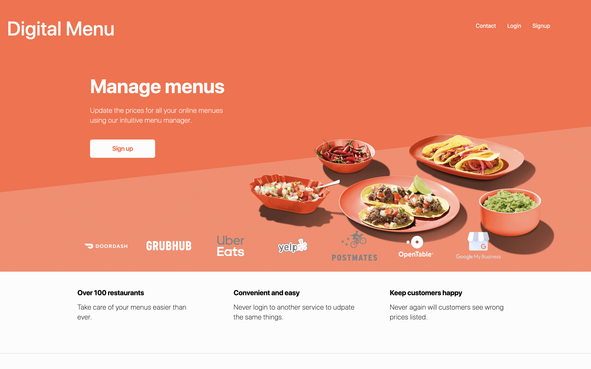

Backend API - https://github.com/jayceazua/digitalMenu

# Digital-Menu-Frontend
Digital Menu x Restaurant intuitive menu management. (React, Redux, JSX, ES6, Scss, OOCSS3, HTML5, jQuery) (Node, Express Mongo Backend API)




## Getting Started

These instructions will get you a copy of the project up and running on your local machine for development.

### Prerequisites

What things you need to install the software and how to install them

1. Run on Linux, Unix or Windows operating systems.
2. Node: any 8.x version starting with 8.4.0 or greater
3. Yarn: See Yarn website for installation instructions

### Installing

A step by step series of examples that tell you how to get a development env running

Clone the repository

```
git clone https://github.com/AwesomeZaidi/Digital-Menu-Frontend`
```

From the root directory of the project, install the dependencies and modules.

```
yard add
```

Once completed, run `yarn start` to spin up your local server and visit your browser at `locatlhost:3000` to view and interact with the application.

### Troubleshooting

`yarn reset` to clear the local cache

## Built With

* [React](https://reactjs.org/) - The web framework used, React JS  
* [Redux](https://github.com/reduxjs/redux) - Predictable state container
* [Scss](https://github.com/sass/sass) - CSS made better for styling

## Contributing

Please read [CONTRIBUTING.md](https://gist.github.com/PurpleBooth/b24679402957c63ec426) for details on our code of conduct, and the process for submitting pull requests to us.

## Versioning

This is currently version 0 and we will be making more iterations in the near future.

## Authors

* **Asim Zaidi** - *Initial work* - [GitHub](https://github.com/awesomezaidi), [Email](asimzaidih@gmail.com), [LinkedIn](https://linkedin.com/in/zaidiasim), [Twitter](https://twitter.com/theasimzaidi)

## License

This project is licensed under the MIT License - see the [LICENSE.md](LICENSE.md) file for details

## Acknowledgments

* My front end mentors **Joe Rezendes** - [GitHub](https://github.com/joerez) and my front end instructor from Make School, Mitchell Hudson - [GitHub](https://github.com/soggybag) for all the help in scoping and debugging.
* My teammate Jaycee Azua [GitHub](https://github.com/jayceazua) for developing the backend API that this product uses.
